# About This Site

This is a community-led open database dedicated to comprehensively documenting the **2025 Tai Po Wang Fuk Court Fire**. The original intention of establishing this website is to provide an objective, transparent, and permanent historical archive for the public, survivors, and families in an era of fragmented information.

## Incident Background

In the afternoon of November 26, 2025, Wang Fuk Court in Tai Po, Hong Kong, experienced one of the most severe residential fires in modern Hong Kong history. The fire reportedly originated from renovation work on the building's exterior and rapidly spread to multiple blocks. This disaster resulted in significant casualties (reportedly over 150 deceased) and property damage, shattering countless families. The incident has raised widespread public concern regarding building maintenance safety, the use of flammable construction materials (such as expanded polystyrene), and fire safety regulations.

## Key Facts

1. The fire reportedly originated from renovation work on the building's exterior, involving the use of flammable construction materials (expanded polystyrene).
2. The fire rapidly spread to multiple blocks, resulting in over 150 casualties and irreversible loss of life.
3. The incident sparked a comprehensive public review of building maintenance safety and fire safety regulations.

## Project Mission

This project is a non-profit open-source initiative. Our core mission includes:

1. **Preserving Historical Truth**: Compiling information from news reports, government announcements, eyewitness testimonies, and visual records to establish a detailed incident timeline, ensuring that future generations can understand the full scope of the event.
2. **Promoting Public Safety**: Providing data for the review of building safety policies by analyzing the causes of the fire and the rescue process, with the hope of preventing similar tragedies from recurring.
3. **Remembrance and Commemoration**: Maintaining a solemn digital memorial space for the deceased and survivors to ensure that the pain is not forgotten.

## Operation Mechanism and Collaboration Workflow

This website combines automated data collection with public collaboration, striving to ensure the comprehensiveness and accuracy of information. To lower the barrier to participation, we have designed a unique collaboration mechanism:

### 1. Anonymous Collaboration (No Login Required)

We believe everyone can contribute a piece to the puzzle of history. Therefore, this site adopts an "Anonymous Collaboration" model:

- **Zero-Entry Participation**: You **do not need to register or log in** to an account to directly propose edits to the website content.
- **Real-time Revisions**: If you find errors in the timeline, data, or descriptions, clicking the "Edit" button on the page will enter editing mode.

### 2. Media Content Hosting Strategy

Due to resource and long-term maintenance considerations, **the site server does not directly store media files (images or videos) uploaded by users**.

- **Recommended Platforms**: We suggest using [**8upload**](https://8upload.com/) for images and [**Dailymotion**](https://www.dailymotion.com/) for videos, then pasting the links into this site.
  - **Pros**: Significantly reduces server and bandwidth costs for non-profit projects; utilizes established video platforms' CDN technology for faster browsing; offloads copyright responsibility and content management to larger platforms.
  - **Cons**: Risk of "Link Rot" if third-party platforms close or delete files; lower control over content persistence; some free platforms may have ad interference.

### 3. Community Review Process (Discord)

To ensure data accuracy and prevent malicious vandalism, all submitted changes do not take effect immediately but instead enter a community review process:

1. **Submit Change**: After you send an edit suggestion, the system generates a "Change Request."
2. **Community Review**: This request is instantly transmitted to our **Discord community server**.
3. **Multi-party Verification**: Community volunteers and administrators review your edits and verify the attached source links or evidence.
4. **Official Publication**: Once the review is approved, your contribution will be merged and officially updated on the website.

## Technical Architecture and Stack

To ensure website performance, scalability, and ease of maintenance, we adopt a modern full-stack tech stack:

### Frontend Framework

- **Next.js 16 (App Router)**: Utilizes React Server Components for loading speed and SEO optimization, ensuring information is effectively indexed by search engines.
- **Tailwind CSS 4**: A modern utility-first CSS framework for responsive design, ensuring a high-quality reading experience on both mobile and desktop.
- **Radix UI & Shadcn UI**: Providing accessible and high-quality UI components.
- **Hono**: A lightweight web framework used for API communication and type-safe RPC client.

### Content Management System (CMS)

- **Payload CMS 3**: A highly extensible headless content management system (CMS) that provides an efficient and intuitive editing interface and flexible API for managing site data.
- **SQLite**: A lightweight, portable, and high-performance database engine that runs without a server, making it ideal for read-heavy archive projects and easy local reproduction.
- **Markdown**: We use Markdown as the single source of truth for content, ensuring maximum readability, excellent version control compatibility (Git), and long-term data preservation.

### Backend and Automation (Backend & Worker)

- **Crawler**: Automatically gathers data from public news sources.
- **Normalizer**: Converts unstructured web data into a unified format.
- **Uploader**: Synchronizes processed data to the CMS via GraphQL API.

### Discord Bot (Community Review Bot)

- **Deno**: Built using the Deno runtime for better security and native TypeScript support.
- **Hono**: Serving as an HTTP API server to handle webhook requests from the frontend.
- **Discord.js**: Interacting with the Discord server to send review notifications and handle commands.

### Testing and Quality Assurance (QA)

- **Playwright**: Performs end-to-end (E2E) testing to simulate real user operations.
- **Vitest**: Used for unit and integration testing.
- **Biome**: Replaces traditional ESLint/Prettier for extremely fast code formatting and checking.

### System Operation Flowchart

```mermaid
graph TD
    %% --- Style Definitions (Tailwind OKLCH Project Palette) ---
    %% System (Slate): Core Architecture
    classDef system fill:#f1f5f9,stroke:#334155,stroke-width:2px,color:#0f172a,rx:6,ry:6;
    %% User (Green): Users & Community
    classDef user fill:#f0fdf4,stroke:#15803d,stroke-width:2px,color:#14532d,rx:6,ry:6;
    %% External (Amber): External Sources
    classDef external fill:#fffbeb,stroke:#b45309,stroke-width:2px,color:#78350f,rx:6,ry:6;
    %% Database (Purple): Data Storage
    classDef database fill:#f3e8ff,stroke:#7e22ce,stroke-width:2px,color:#581c87,shape:cylinder;
    %% Git (Red): Version Control
    classDef git fill:#fef2f2,stroke:#b91c1c,stroke-width:2px,color:#7f1d1d,rx:6,ry:6;

    linkStyle default stroke:#64748b,stroke-width:2px,fill:none;

    %% --- Layer 1: Inputs ---
    subgraph Inputs ["👥 Input Sources"]
        direction LR
        User["👤 Anonymous User"]:::user
        Sources["📡 External Data (In Design)"]:::external
    end

    %% --- Layer 2: Interface ---
    subgraph Interface ["🌐 Website Frontend"]
        Frontend["Next.js Website"]:::system
    end

    %% --- Layer 3: Governance ---
    subgraph Governance ["⚖️ Community Governance (Discord)"]
        direction TB
        Discord["💬 Community Review"]:::user
        Bot["🤖 Discord Bot"]:::system
    end

    %% --- Layer 4: Version Control ---
    subgraph VCS ["🐙 Version Control (GitHub)"]
        direction TB
        Feature["📝 Change Branch {page}/{hash}"]:::git
        Main["🛡️ Main Branch tpwfc-data/main"]:::git
        Conflict["👨‍💻 Manual Repair"]:::user
    end

    %% --- Layer 5: Automation Pipeline ---
    subgraph Pipeline ["⚙️ Automation Pipeline (Go Worker)"]
        direction LR
        Crawler["🕷️ Crawler"]:::system
        Normalizer["🔄 Normalizer"]:::system
        Uploader["📤 Uploader"]:::system

        Crawler --> Normalizer --> Uploader
    end

    %% --- Layer 6: Data Storage ---
    CMS[("🗄️ Payload CMS")]:::database

    %% === Flow Connections ===

    %% 1. User Submission
    User -->|"1. Browse/Submit"| Frontend
    Frontend -.->|"2. RESTful"| Discord

    %% 2. Review and Branching
    Discord -->|"3a. /approve"| Bot
    Bot -->|"3b. Create Branch"| Feature

    %% 3. Merge Flow
    Discord -->|"4. /merge"| Bot
    Bot -->|"5. Check Merge"| Feature

    Feature -->|"✅ No Conflict"| Main
    Feature -.->|"❌ Conflict"| Conflict
    Conflict -->|"Resolve"| Main

    %% 4. Reseed and Update
    Main -->|"6. Trigger Reseed"| Crawler
    Uploader -->|"7. Update Data"| CMS
    CMS <--> Frontend

    %% 5. Future External Data
    Sources -.->|"Future Integration"| Crawler
```

### Detailed Collaboration Workflow Description

To ensure data rigor and system stability, our collaboration workflow integrates the Discord community and the GitHub version control system, using Markdown as the data storage medium:

1. **Submission**: Anonymous users submit edit proposals on the website frontend.
2. **Review**: The system sends requests via Webhook to the Discord review channel.
3. **Branching**: After a proposal is endorsed by community members via the `/approve` command in Discord, the Bot creates an independent branch on GitHub containing the **Markdown changes**.
4. **Batch Merging**:
   - Administrators enter the `/merge` command in Discord.
   - The system checks all "Approved" branches for conflicts with the main branch.
   - **All conflicts must be manually resolved prior to merging into the main branch** (usually performed on the GitHub page).
5. **Reseeding**: Once changes are merged into the main branch, the system automatically triggers the **Go Worker (Crawler & Uploader)**:
   - The **Go Worker** fetches the latest **Markdown files** from the GitHub main branch.
   - The **Go Worker** parses these files and reseeds the data into the Payload CMS database.
   - The frontend website subsequently displays the updated information.
6. **Automated Data Sources (Future)**: Currently, the automated collection process for "External Data Sources" is still under design and will be integrated into the Go Worker system in the future to enable fully automated data updates.

## Join Us

The operation of this site relies on the selfless contributions of volunteers. We are currently looking for assistance in the following areas:

- **Fact Checkers**:
  - **Responsibilities**: Verify user-submitted edit proposals in the Discord community, check news sources and evidence, and ensure information is true and accurate.
- **Web Design and Scaffolding**:
  - **Responsibilities**: Assist in designing legible, solemn, and informative page layouts to optimize user experience.
- **Technical Development**:
  - **Responsibilities**: Assist in handling GitHub merge conflicts and maintaining core functionality.

## Developer Information

The source code for this site is hosted on GitHub: [https://github.com/TPWFC](https://github.com/TPWFC)

**⚠️ Current Development Status Note**:
This project is currently in the **Beta** stage; the core architecture and functions have not been fully finalized.

- **Proposals/Contributions**: Due to frequent system restructuring and adjustments, code submissions at this stage may face severe merge conflicts or require significant modifications.
- **Future Planning**: We will warmly welcome developer contributions once the system exits the Beta stage and stabilizes.

## Data Sources

The data for this site primarily comes from public channels, including but not limited to:

- Major news media reports
- Government-issued press releases and investigation reports
- Public images and eyewitness information on social media (processed for verification and de-identification)

## Disclaimer

This website is a community-initiated database and is not an official website of the Government of the Hong Kong Special Administrative Region. While we strive to ensure the accuracy of the information, content may be updated as new investigations progress. For any formal legal or rescue needs, please contact the relevant government departments directly.

## Contact Us

If you have information about the incident you wish to provide, or if you find errors in the content of this site, please contact us through the channels provided on the website or join our Discord community for discussion.

<!-- METADATA_START
VALIDATION: TRUE
LAST_MODIFY: 2025-12-24T17:10:24Z
HASH: 77923572e5de07b598224d5ad1151e3f2ebb3fc25fc7e77ec67f6898aa5087c6
METADATA_END -->
