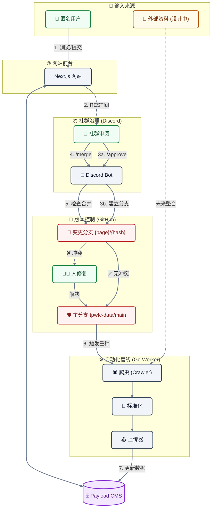

# 关于本站

这是一个由民间发起、致力于完整记录 **2025 年大埔宏福苑大火** 事件的公开数据库。我们建立这个网站的初衷，是为了在信息纷乱的时代，为公众、幸存者及家属提供一个客观、透明且永久的历史档案。

## 事件背景

2025 年 11 月 26 日下午，位于香港大埔的宏福苑发生了香港现代史上最严重的住宅大火之一。火势据报源自大厦外墙的装修工程，并迅速蔓延至多座大楼。这场灾难造成了严重的人员伤亡（据报超过 150 人罹难）及财产损失，无数家庭因此破碎。事件引发了社会对于大厦维修安全、易燃建材使用（如发泡胶）以及消防条例的广泛关注。

## 关键事实

1. 火势据报源自大厦外墙的装修工程，涉及易燃建材（发泡胶）的使用。
2. 火势迅速蔓延至多座大楼，导致超过 150 人罹难，造成无法挽回的伤亡。
3. 事件引发社会对大楼维修安全及消防条例的全面检讨。

## 建站宗旨

本项目是非营利性的开源项目，我们的核心宗旨包括：

1. **保存历史真相**：汇总来自新闻报道、政府公告、目击者证词及影像纪录，建立详尽的事件时间线，确保后世能了解事件的全貌。
2. **推动公众安全**：通过分析火灾成因与救援过程的数据，为楼宇安全政策的检讨提供参考，期望防止类似悲剧再次发生。
3. **悼念与记忆**：为逝者与生还者保留一个庄严的数字纪念空间，不让伤痛被遗忘。

## 运作机制与协作流程

本网站结合了自动化数据采集与公众协作，致力于确保信息的全面性与准确性。为了降低参与门槛，我们设计了独特的协作机制：

### 1. 匿名协作 (无需登录)

我们相信每个人都能为历史的拼图贡献一份力量。因此，本站采用“匿名协作”模式：

- **零门槛参与**：您**无需注册或登录**账户，即可直接对网站内容提出修改建议。
- **即时修订**：若您发现时间线、数据或描述有误，点击页面上的“编辑”按钮即可进入编辑模式。

### 2. 媒体内容托管策略

基于资源与长期维护的考虑，**本站服务器不直接存储由用户上传的媒体档案（图片或视频）**。

- **建议平台**：我们建议您使用 [**8upload**](https://8upload.com/) 上传图片，并使用 [**Dailymotion**](https://www.dailymotion.com/) 上传视频，然后将链接贴入本站。
  - **优点**：大幅降低非营利项目的服务器与带宽成本；利用成熟影音平台的 CDN 技术，确保浏览速度；版权责任与内容管理由大平台分担。
  - **缺点**：存在链接失效（Link Rot）的风险（若第三方平台关闭或删除档案）；我们对内容的持久性控制力较低；部分免费平台可能会有广告干扰。

### 3. 社群审核流程 (Discord)

为确保资料的准确性并防止恶意破坏，所有提交的修改并不会立即生效，而是进入社群审核流程：

1. **提交变更**：当您送出编辑建议后，系统会生成一份“变更请求”。
2. **社群审阅**：这份请求会即时传送至我们的 **Discord 社群服务器**。
3. **多方核实**：由社群志愿者与管理员检视您的修改，并核对所附的来源链接或证据。
4. **正式发布**：一旦审核通过，您的贡献将被合并并正式更新至网站上。

## 技术架构与堆叠

为了确保网站的性能、可扩展性与易维护性，我们采用了现代化的全栈技术堆叠：

### 前端框架 (Frontend)

- **Next.js 16 (App Router)**: 利用 React Server Components 技术，提供加载速度与 SEO 优化，确保信息能被搜索引擎有效索引。
- **Tailwind CSS 4**: 现代化 utility-first CSS 框架，实现响应式设计，确保网站在手机与桌面端均有良好阅读体验。
- **Radix UI & Shadcn UI**: 提供无障碍 (Accessible) 且高质量的 UI 组件。
- **Hono**: 轻量级 Web 框架，用于 API 通讯与类型安全的 RPC 客户端。

### 内容管理系统 (CMS)

- **Payload CMS 3**：一款极具扩展性的无头内容管理系统（Headless CMS），为本站提供高效且直观的内容编辑界面与 API，确保数据管理的灵活性。
- **SQLite**：采用高效、便携且轻量级的数据库引擎，无需独立服务器即可运行，非常适合此类以只读与归档为主的应用场景，并便于本地同步。
- **Markdown**：我们将 Markdown 作为内容的单一事实来源，这确保了数据的高度可读性、易于版本控制（Git），并能跨平台长期保存而不受内容格式限制。

### 后端与自动化 (Backend & Worker)

- **Crawler (爬虫)**: 自动化搜集公开新闻源。
- **Normalizer (标准化器)**: 将非结构化的网页数据转换为统一格式。
- **Uploader (上传器)**: 通过 GraphQL API 将处理后的数据同步至 CMS。

### Discord Bot (社群审核机器人)

- **Deno**: 使用 Deno 运行时构建，提供更好的安全性与 TypeScript 原生支持。
- **Hono**: 作为 HTTP API 服务器，处理来自前端的 Webhook 请求。
- **Discord.js**: 与 Discord 服务器进行互动，发送审核通知与处理指令。

### 测试与质量保证 (QA)

- **Playwright**: 进行端对端 (E2E) 測試，模拟真实使用者操作，确保核心功能正常。
- **Vitest**: 用于单元测试与集成测试。
- **Biome**: 取代传统的 ESLint/Prettier，提供极速的代码格式化与检查。

### 系统运作流程图

### 详细协作流程说明

为了确保资料的严谨性与系统的稳定性，我们的协作流程整合了 Discord 社群与 GitHub 版本控制系统，并以 Markdown 作为资料存储的媒介：

1. **提交 (Submission)**：匿名用户在网站前端提交修改建议。
2. **审核 (Review)**：系统通过 Webhook 将请求发送至 Discord 审核频道。
3. **分支建立 (Branching)**：当建议在 Discord 获得社群成员输入 `/approve` 认可后，Bot 会在 GitHub 上建立一个包含该 **Markdown 变更** 的独立分支。
4. **批量合并 (Batch Merging)**：
   - 管理员在 Discord 输入 `/merge` 指令。
   - 系统会检查所有“已批准 (Approved)”的分支与主分支是否存在冲突。
   - **所有冲突必须在合并入主分支前手动解决**（通常在 GitHub 页面上进行）。
5. **重种 (Reseeding)**：当变更被合并入主分支 (Main Branch) 后，系统会自动触发 **Go Worker (Crawler & Uploader)**：
   - **Go Worker** 会从 GitHub 主分支抓取最新的 **Markdown 档案**。
   - **Go Worker** 会解析这些档案，并将资料重新写入 (Seed) 至 Payload CMS 数据库中。
   - 前端网站随即显示更新后的信息。
6. **自动化数据源 (Future)**：目前“外部资料来源”的自动采集流程仍在设计阶段，未来将与 Go Worker 系统整合，实现全自动化的数据更新。

## 参与我们

本站的运作依赖志愿者的无私贡献。目前我们特别需要以下领域的协助：

- **事实核查员 (Fact Checker)**：
  - **职责**：在 Discord 社群中验证用户提交的修改建议，核对新闻来源与证据，确保信息真实无误。
- **网页设计与排版 (Page Design Scaffolding)**：
  - **职责**：协助设计易读、肃穆且信息清晰的页面布局，优化使用者体验。
- **技术开发 (Developer)**：
  - **职责**：协助处理 GitHub 上的合并冲突 (Merge Conflicts) 及维护核心功能。

## 开发者信息

本站的源代码托管于 GitHub：[https://github.com/TPWFC](https://github.com/TPWFC)

**⚠️ 目前开发状态说明**：
本项目目前仍处于 **Beta (测试)** 阶段，核心架构与功能尚未完全定案。

- **暂不鼓励提交代码 (Code Contribution)**：由于系统正进行频繁的重构与调整，现阶段提交的代码可能面临严重的合并冲突或需要大幅修改。
- **未来规划**：待系统脱离 Beta 阶段并稳定后，我们将热烈欢迎开发者参与贡献。

## 资料来源

本站的资料主要来自公开渠道，包括但不限于：

- 主流新闻媒体报道
- 政府发布的新闻稿与调查报告
- 社交媒体上的公开影像与目击信息（经过核实与去识别化处理）

## 免责声明

本网站为民间自发建立的数据库，并非香港特别行政区政府官方网站。尽管我们致力于确保信息的准确性，但内容可能随新的调查进展而更新。如有任何正式的法律或救援需求，请直接联系相关政府部门。

## 联系我们

如果您有关于事件的资料希望提供，或发现本站内容有误，欢迎通过网站提供的渠道与我们联系，或加入我们的 Discord 社群参与讨论。

<!-- METADATA_START
VALIDATION: TRUE
LAST_MODIFY: 2025-12-24T17:10:24Z
HASH: ed686d34f5757635b2cea37e54f9dfcae3dfc3f82581087dc46d1e1524caa985
METADATA_END -->
