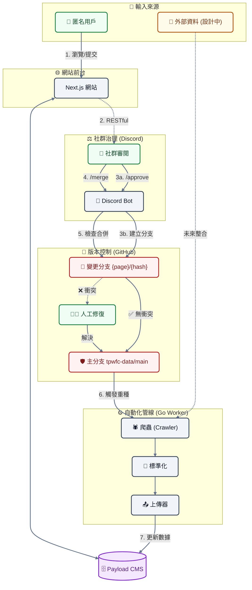

# 關於本站

這是一個由民間發起、致力於完整記錄 **2025 年大埔宏福苑大火** 事件的公開資料庫。我們建立這個網站的初衷，是為了在資訊紛亂的時代，為公眾、倖存者及家屬提供一個客觀、透明且永久的歷史檔案。

## 事件背景

2025 年 11 月 26 日下午，位於香港大埔的宏福苑發生了香港現代史上最嚴重的住宅大火之一。火勢據報源自大廈外牆的裝修工程，並迅速蔓延至多座大樓。這場災難造成了嚴重的人員傷亡（據報超過 150 人罹難）及財產損失，無數家庭因此破碎。事件引發了社會對於大廈維修安全、易燃建材使用（如發泡膠）以及消防條例的廣泛關注。

## 關鍵事實

1. 火勢據報源自大廈外牆的裝修工程，涉及易燃建材（發泡膠）的使用。
2. 火勢迅速蔓延至多座大樓，導致超過 150 人罹難，造成無法挽回的傷亡。
3. 事件引發社會對大廈維修安全及消防條例的全面檢討。

## 建站宗旨

本計畫是非營利性的開源項目，我們的核心宗旨包括：

1. **保存歷史真相**：彙整來自新聞報導、政府公告、目擊者證詞及影像紀錄，建立詳盡的事件時間軸，確保後世能了解事件的全貌。
2. **推動公眾安全**：透過分析火災成因與救援過程的數據，為樓宇安全政策的檢討提供參考，期望防止類似悲劇再次發生。
3. **悼念與記憶**：為逝者與生還者保留一個莊嚴的數位紀念空間，不讓傷痛被遺忘。

## 運作機制與協作流程

本網站結合了自動化數據採集與公眾協作，致力於確保資訊的全面性與準確性。為了降低參與門檻，我們設計了獨特的協作機制：

### 1. 匿名協作 (無需登入)

我們相信每個人都能為歷史的拼圖貢獻一份力量。因此，本站採用「匿名協作」模式：

- **零門檻參與**：您**無需註冊或登入**帳戶，即可直接對網站內容提出修改建議。
- **即時修訂**：若您發現時間軸、數據或描述有誤，點擊頁面上的「編輯」按鈕即可進入編輯模式。

### 2. 媒體內容託管策略

基於資源與長期維護的考量，**本站伺服器不直接儲存由用戶上傳的媒體檔案（圖片或影片）**。

- **建議平台**：我們建議您使用 [**8upload**](https://8upload.com/) 上傳圖片，並使用 [**Dailymotion**](https://www.dailymotion.com/) 上傳影片，然後將連結貼入本站。
  - **優點**：大幅降低非營利項目的伺服器與頻寬成本；利用成熟影音平台的 CDN 技術，確保瀏覽速度；版權責任與內容管理由大平台分擔。
  - **缺點**：存在連結失效（Link Rot）的風險（若第三方平台關閉或刪除檔案）；我們對內容的持久性控制力較低；部分免費平台可能會有廣告干擾。

### 3. 社群審核流程 (Discord)

為確保資料的準確性並防止惡意破壞，所有提交的修改並不會立即生效，而是進入社群審核流程：

1. **提交變更**：當您送出編輯建議後，系統會生成一份「變更請求」。
2. **社群審閱**：這份請求會即時傳送至我們的 **Discord 社群伺服器**。
3. **多方核實**：由社群志願者與管理員檢視您的修改，並核對所附的來源連結或證據。
4. **正式發布**：一旦審核通過，您的貢獻將被合併並正式更新至網站上。

## 技術架構與堆疊

為了確保網站的效能、可擴展性與易維護性，我們採用了現代化的全端技術堆疊：

### 前端框架 (Frontend)

- **Next.js 16 (App Router)**: 利用 React Server Components 技術，提供載入速度與 SEO 優化，確保資訊能被搜尋引擎有效索引。
- **Tailwind CSS 4**: 現代化的 utility-first CSS 框架，實現響應式設計，確保網站在手機與桌面端均有良好閱讀體驗。
- **Radix UI & Shadcn UI**: 提供無障礙 (Accessible) 且高品質的 UI 元件。
- **Hono**: 輕量級 Web 框架，用於 API 通訊與類型安全的 RPC 客戶端。

### 內容管理系統 (CMS)

- **Payload CMS 3**：一款極具擴展性的無頭內容管理系統（Headless CMS），為本站提供高效且直觀的內容編輯介面與 API，確保資料管理的靈活性。
- **SQLite**：採用高效、便攜且輕量級的資料庫引擎，無需獨立伺服器即可運行，非常適合此類以唯讀與歸檔為主的應用情境，並便於本地同步。
- **Markdown**：我們將 Markdown 作為內容的單一事實來源，這確保了資料的高度可讀性、易於版本控制（Git），並能跨平台長期保存而不受內容格式限制。

### 後端與自動化 (Backend & Worker)

- **Crawler (爬蟲)**: 自動化搜集公開新聞源。
- **Normalizer (標準化器)**: 將非結構化的網頁數據轉換為統一格式。
- **Uploader (上傳器)**: 透過 GraphQL API 將處理後的數據同步至 CMS。

### Discord Bot (社群審核機器人)

- **Deno**: 使用 Deno 運行時構建，提供更好的安全性與 TypeScript 原生支援。
- **Hono**: 作為 HTTP API 伺服器，處理來自前端的 Webhook 請求。
- **Discord.js**: 與 Discord 伺服器進行互動，發送審核通知與處理指令。

### 測試與品質保證 (QA)

- **Playwright**: 進行端對端 (E2E) 測試，模擬真實使用者操作，確保核心功能正常。
- **Vitest**: 用於單元測試與整合測試。
- **Biome**: 取代傳統的 ESLint/Prettier，提供極速的程式碼格式化與檢查。

### 系統運作流程圖

### 詳細協作流程說明

為了確保資料的嚴謹性與系統的穩定性，我們的協作流程整合了 Discord 社群與 GitHub 版本控制系統，並以 Markdown 作為資料儲存的媒介：

1. **提交**：匿名用戶在網站前端提交修改建議。
2. **審核**：系統透過 Webhook 將請求發送至 Discord 審核頻道。
3. **分支建立**：當建議在 Discord 獲得社群成員輸入 `/approve` 認可後，Bot 會在 GitHub 上建立一個包含該 **Markdown 變更** 的獨立分支。
4. **批量合併**：
   - 管理員在 Discord 輸入 `/merge` 指令。
   - 系統會檢查所有「已批准 (Approved)」的分支與主分支是否存在衝突。
   - **所有衝突必須在合併入主分支前手動解決**（通常在 GitHub 頁面上進行）。
5. **重種**：當變更被合併入主分支 (Main Branch) 後，系統會自動觸發 **Go Worker (Crawler & Uploader)**：
   - **Go Worker** 會從 GitHub 主分支抓取最新的 **Markdown 檔案**。
   - **Go Worker** 會解析這些檔案，並將資料重新寫入 (Seed) 至 Payload CMS 資料庫中。
   - 前端網站隨即顯示更新後的資訊。
6. **自動化數據源 (Future)**：目前「外部資料來源」的自動採集流程仍在設計階段，未來將與 Go Worker 系統整合，實現全自動化的數據更新。

## 參與我們

本站的運作依賴志願者的無私貢獻。目前我們特別需要以下領域的協助：

- **事實查核員**：
  - 在 Discord 社群中驗證用戶提交的修改建議，核對新聞來源與證據，確保資訊真實無誤。
- **網頁設計與排版**：
  - 協助設計易讀、肅穆且資訊清晰的頁面佈局，優化使用者體驗。
- **技術開發**：
  - 協助處理 GitHub 上的合併衝突 (Merge Conflicts) 及維護核心功能。

## 開發者資訊

本站的原始碼託管於 GitHub：[https://github.com/TPWFC](https://github.com/TPWFC)

**⚠️ 目前開發狀態說明**：
本項目目前仍處於 **Beta (測試)** 階段，核心架構與功能尚未完全定案。

- **暫不鼓勵提交程式碼貢獻**：由於系統正進行頻繁的重構與調整，現階段提交的程式碼可能面臨嚴重的合併衝突或需要大幅修改。
- **未來規劃**：待系統脫離 Beta 階段並穩定後，我們將熱烈歡迎開發者參與貢獻。

<!-- METADATA_START
VALIDATION: TRUE
LAST_MODIFY: 2025-12-24T17:10:24Z
HASH: 00b953900cd982b04f8bf76a8ac5bb983e9625aee491ef09bca89e3d955a69c9
METADATA_END -->
